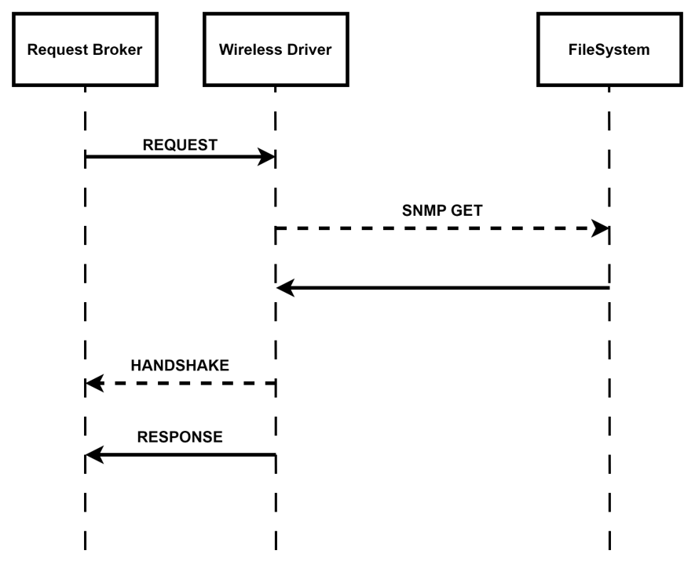

# Image Recognition with Privacy

- eBPF Observability Platform
- VEXF Packet and Frame
- HTTP over VEXF with ETags

We introduce a computer networking protocol that introduces more privacy within Cloud, Edge and other telecommunication technology involving Sensors and even for detecting interferences

We have generated a text dataset that involves text recognition for english characters consisting of buckets starting with A - Z letters. 

## Model(s) Used

The model we present are: 

- CNN-LSTM model (Convolutional Recurrent Neural Network Model, CRNN) and the **PaddleOCR Model** which outperforms the **CNN-LSTM model**, by demonstrating the usage of PaddleOCR directly into the **OpenVINO library**. 

- We use an inference model for OCR: the **MMOCR Text Recognition Model**, for demonstrating **OpenVINO Engine** - model usage and future deployments as a high-performance computing deep learning model. 

- We also present a RoboFlow based **Number Plate Recognition Model** to demonstrate Private & Secure Data Exchange of Number Plates. 

- We have developed a **Construction Dataset** involving: Piling Rigs, Load Carrying Cranes, Cranes, Machinery such as Excavators and other objects like Buildings, Soil. We also detect Person / People, Person with Pre-Protective Equipment (PPE). 

Apart from the models, we demonstrate the purpose of integration of Privacy and Discoverability through: 

- Transferring sensitive information such as a Passport over the Network using a Defined Protocol, called VEXF
- Use of Traceability within a VEXF Packet, through a 5-Level forms of representation
- Explaining the Delivery of Protocol through a 3-way Process
- Protecting the Privacy by Allowing the Devices to perform a certain AI Process
- Representation of a Packet Through an Encoding, such that any Interference can be detected
- Using eBPF for Observability

## Repositories Used

#### Adapting-OCR
https://github.com/Deepayan137/Adapting-OCR

#### CRNN.PYTORCH
https://github.com/meijieru/crnn.pytorch

#### PaddleOCR, The Paddle Project
https://github.com/PaddlePaddle/PaddleOCR

#### MMOCR, the Open-MMLab Project
https://github.com/open-mmlab/mmocr

#### EasyOCR, the Jaided AI Project
https://github.com/JaidedAI/EasyOCR

### Text Spotting Demo from OpenodelZoo
https://github.com/openvinotoolkit/open_model_zoo

#### TextRecognitionDatasetGeneration
https://github.com/Belval/TextRecognitionDataGenerator

## Delivery of Project

### SecureScanned, A Mobile Application Prototype

We present a Mobile App that can store Scanned Copies of Sensitive Information with a prototype at:

https://documents-secure-scanned.glide.page

### VEXF with eBPF, Integrating Observability using VEXF Packets

```bash

cd notebooks/resources/

python3 bpcc_ebpf_sugar.py -v

```

## Other Technology Used

We have used Numpy, MNIST for recognizing Digits from a Scikit-Learn package. All can be used within an Intel Optimized Libraries and oneAPI Data Analytics System. 

## Installation of Packages to test, experiment and verify the prototype

```bash

python3 -m pip install -r requirements.txt

```

## How to run the code

### Generate the Dataset, Syntehtic Dataset of Characters / Text

`TextRecognitionDataGanerator`

```bash

pip3 install trdg

trdg -c 1000 -w 5 -f 64

```

#### From the Open Model Zoo, Use a Pre-Trained Model from OpenVINO

```bash

pip3 install openvino
pip3 install openvino-dev

```

```bash

omz_model_downloader --name "text-spotting-*" --output_dir "./models/"

```

#### Model Inference for text spotting

[https://github.com/openvinotoolkit/open_model_zoo/tree/master/demos/text_spotting_demo/python](https://github.com/openvinotoolkit/open_model_zoo/tree/master/demos/text_spotting_demo/python)


## How to train a custom model with Text Spotting

```bash

git clone https://github.com/openvinotoolkit/training_extensions projects/training_extensions/

git checkout misc

```

### Download the model

```bash

curl https://storage.openvinotoolkit.org/repositories/openvino_training_extensions/models/text_spotting/alphanumeric_text_spotting/text_spotting_0005/epoch_25.pth -o ./models/snapshot.pth

```

### Export the PyTorch Model to OpenVINO and Train the Model

```bash

cd projects/training_extensions/

cd ote/

export MODEL_TEMPLATE=`realpath ./model_templates/alphanumeric-text-spotting/text-spotting-0005/template.yaml`
export WORK_DIR=/tmp/my-$(basename $(dirname $MODEL_TEMPLATE))
export SNAPSHOT=./models/snapshot.pth
python3 ./projects/training_extensions/instantiate_template.py ${MODEL_TEMPLATE} ${WORK_DIR}

export OTE_DIR='./projects/training_extensions/ote'

export ADD_EPOCHS=1
export EPOCHS_NUM=$((`cat ${MODEL_TEMPLATE} | grep epochs | tr -dc '0-9'` + ${ADD_EPOCHS}))
export TRAIN_ANN_FILE=${OTE_DIR}/data/horizontal_text_detection/annotation.json
export TRAIN_IMG_ROOT=${OTE_DIR}/data/horizontal_text_detection/
export VAL_ANN_FILE=${TRAIN_ANN_FILE}
export VAL_IMG_ROOT=${TRAIN_IMG_ROOT}
export TEST_ANN_FILE=${TRAIN_ANN_FILE}
export TEST_IMG_ROOT=${TRAIN_IMG_ROOT}

cd ${WORK_DIR}

python export.py \
   --load-weights ${SNAPSHOT} \
   --save-model-to export

python train.py \
   --resume-from ${SNAPSHOT} \
   --train-ann-files ${TRAIN_ANN_FILE} \
   --train-data-roots ${TRAIN_IMG_ROOT} \
   --val-ann-files ${VAL_ANN_FILE} \
   --val-data-roots ${VAL_IMG_ROOT} \
   --save-checkpoints-to outputs \
   --epochs ${EPOCHS_NUM} \
&& export SNAPSHOT=outputs/latest.pth \
&& export EPOCHS_NUM=$((${EPOCHS_NUM} + ${ADD_EPOCHS}))

```

## Purpose of oneAPI

- Applying Machine Learning using Intel Optimized Python with oneAPI is easier
- By connecting `event_config` to the Database, the HTTP over VEXF Frame is created by a oneAPI package to be sent to Cloud

## Purpose of eBPF

- eBPF has Ethernet Packet Filters in Kernel Space, and the packet header is written inside the Kernel Space.
- Our solution enables implementation of Applications through the import of the Package

## How to run the Notebook

```bash

cd notebooks/

# Copy the projects/ folder

# Windows
cp ../projects/ notebooks/projects/

# Linux
ln -s ../projects/ notebooks/projects/

jupyter notebook intel-oneapi-hackathon-image-recognition-with-privacy-Exploratory-Data-Analysis.ipynb 

```

## Outperforming Model(s)

### PaddleOCR

```bash

!curl https://paddleocr.bj.bcebos.com/PP-OCRv3/english/en_PP-OCRv3_rec_infer.tar -o  models/en_PP-OCRv3_rec_infer.tar

```

### EasyOCR

```bash

!curl https://github.com/JaidedAI/EasyOCR/releases/download/v1.3/english_g2.zip -o models/english_g2.zip


```

## Inference from Models

### PaddleOCR

```bash

cd tests/

python3 paddleocr_demo.py

```

## Chosen Model

### Text Spotting 005

```bash

omz_model_downloader --name "text-spotting-*" --output_dir "./models/"

```

## VEXF (Vision Exchange Format) Method



### Tests Conducted

#### Create a WiFi or Ethernet Frame

```bash

cd prototype/frame

python3 -c "import create_frame"

```

#### Create an IOCTL Request

```bash

cd prototype/ioctl

python3 -c import "ioctl_request"

```

#### Create MaxHeap Structure

```bash

cd prototype/heap_structure

python3 -c "import maxheap"

```

## Inference from OpenVINO Model

### Sending a Request to the Intel Dev Cloud

```bash

!qsub text_recognition_demo.sh -o {log_out_name} -e {log_err_name}

```

### Output from Text Recognition using OpenVINO Model

```log

########################################################################
#      Date:           Sat 04 Mar 2023 09:44:18 PM PST
#    Job ID:           2231308.v-qsvr-1.aidevcloud
#      User:           u186775
# Resources:           cput=75:00:00,neednodes=1:batch:ppn=2,nodes=1:batch:ppn=2,walltime=06:00:00
########################################################################

[ INFO ] OpenVINO Runtime
[ INFO ] 	build: 2022.3.0-9052-9752fafe8eb-releases/2022/3
[ INFO ] Reading Mask-RCNN model /home/u186775/image-recognition-with-privacy/models/intel/text-spotting-0005/text-spotting-0005-detector/FP16/text-spotting-0005-detector.xml
[ INFO ] Reading Text Recognition Encoder model /home/u186775/image-recognition-with-privacy/models/intel/text-spotting-0005/text-spotting-0005-recognizer-encoder/FP16/text-spotting-0005-recognizer-encoder.xml
[ INFO ] Reading Text Recognition Decoder model /home/u186775/image-recognition-with-privacy/models/intel/text-spotting-0005/text-spotting-0005-recognizer-decoder/FP16/text-spotting-0005-recognizer-decoder.xml
[ INFO ] The Mask-RCNN model /home/u186775/image-recognition-with-privacy/models/intel/text-spotting-0005/text-spotting-0005-detector/FP16/text-spotting-0005-detector.xml is loaded to CPU
[ INFO ] The Text Recognition Encoder model /home/u186775/image-recognition-with-privacy/models/intel/text-spotting-0005/text-spotting-0005-recognizer-encoder/FP16/text-spotting-0005-recognizer-encoder.xml is loaded to CPU
[ INFO ] The Text Recognition Decoder model /home/u186775/image-recognition-with-privacy/models/intel/text-spotting-0005/text-spotting-0005-recognizer-decoder/FP16/text-spotting-0005-recognizer-decoder.xml is loaded to CPU
[ INFO ] Text decoder output names are {'hidden', 'output'}
(573, 820, 3)
(768, 1280, 3)
(1, 3, 768, 1280)
[ INFO ] Text confidence is 0.13285909327739348
[ INFO ] Text Features are ['3', '2', '7', '4', '8', '9', 'fors', 'wayz', '6', 'tuv', 'ghi', 'def', 'lo1', '5', 'aic', 'mnd', 'eci']

########################################################################
# End of output for job 2231308.v-qsvr-1.aidevcloud
# Date: Sat 04 Mar 2023 09:44:42 PM PST
########################################################################

```

### Evaluate a single text using Text Recognition

```python

from sklearn.metrics import accuracy_score

identification = ['3', '2', '7', '4', '8', '9', 'fors', 'wayz', '6', 'tuv', 'ghi', 'def', 'lo1', '5', 'aic', 'mnd', 'eci']
original = ['3', '2', '7', '4', '8', '9', 'pqrs', 'wxyz', '6', 'tuv', 'ghi', 'def', 'jkl', '5', 'abc', 'mno', 'ghi']

total_identification = " ".join(identification)
total_original = " ".join(original)

print("""Identification: {} characters, Original: {} characters, Accuracy: {}""".format(len(total_identification.replace(" ", "")), 
                                                                                        len(total_original.replace(" ", "")), 
                                                                                       accuracy_score(list(total_identification.replace(" ", "")), 
                                                                                                     list(total_original.replace(" ", "")))))

```

